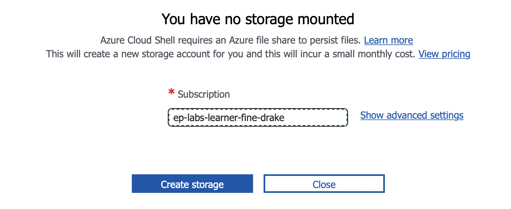

# Hands-on 01 – Explore Azure GUI – Creating a new VM using Azure Portal 

The Azure portal is a browser-based user interface to create Azure resources. Azure virtual machines (VMs) can be created through the Azure portal. </br> 
This Hands-on will guide you through using the Azure portal to deploy a Linux virtual machine (VM) running Ubuntu LTS. To see your VM in action, you also SSH to the VM and install the NGINX web server.

## Sign in to Azure

Please follow the steps as detailed in session <a href="/Azure_Sandbox.md">"Setup Azure Sandbox in Pluralsight"</a> to enable Pluralsight Azure Sandbox & login into the. 

## Create virtual machine

1. In the portal home, under <b>Services </b>, select <b>Virtual Machines </b>
    
2. In the Virtual machines page, click <b>Create </b> and choose <b> Azure Virtual machine. </b>
     
    The Create a virtual machine page opens.
    
3. Under Instance details, enter a <b>name </b> for your name (Ex: VM01) for the Virtual machine name, and choose Ubuntu 20.04 LTS - Gen2 for your Image. Leave the other info to defaults. 
    
4. In the Administrator account session, <b> select Authentication type “Password” option </b> and provide an Username and Password.
    Please make a note of your username and password for connecting to the VM. </br>
    Sample: </br>
    username - testadm </br>
    Password - Pa55@Word123
    
    <br> Ensure to check for the green tick marks against the username & password. </br>
    <b>Note:</b> It is recommended to authenticate using SSH public keys for security. 
5. Under Inbound port rules > Public inbound ports, choose <b>Allow selected ports </b> and then select SSH (22) and HTTP (80) from the drop-down.
    
6. Leave the remaining value to defaults and then select the <b> Review + create </b> button at the bottom of the page.
7. On the Create a virtual machine page, you can see the details about the VM you are about to create. Ensure the review returns, <b> Validation passed</b> </br>
    
8. When you are ready, select <b> Create </b>.
9. When the deployment is finished, select <b>Go to resource </b>.</br>
    
10. On the page for your new VM, select the public IP address and copy it to your clipboard.</br>
     </br>
    Sample: 20.119.75.119

## Connect to virtual machine

For the purpose of this session, we will use the Azure cloud shell to SSH to the newly created VM. 

For more info on Azure cloud shell refer,

https://learn.microsoft.com/en-us/azure/cloud-shell/overview

Note that by default the port 22 for SSH is open and this lab allows the VM to be available in the internet. 

### Configure Azure Cloud Shell

1. Select the Cloud Shell icon on the Azure portal (top right hand corner) </br>
   
2. Select <b>PowerShell</b>. </br>
    
3. Click <b> Create Storage </b>
     </br>
    The cloud shell will be initiated.
     </br>
        

### SSH into the VM
1. In the cloud shell, open an SSH connection to your virtual machine. Replace the IP address with the one from your VM, and username noted previously </br>
    ```sh
    ssh username@public_ip
    ```
    Ex: ssh testadm@20.119.75.119
2. Type <b>yes</b> to accept connection and provide password when prompted </br>
    
3. You are now logged into the VM terminal. </br>
     

## Install web server

To see your VM in action, install the NGINX web server. From your SSH session, update your package sources and then install the latest NGINX package. </br>
```console
    sudo apt-get -y update 
    sudo apt-get -y install nginx
```
Use a web browser of your choice to view the default NGINX welcome page. Type the public IP address of the VM as the web address. The public IP address can be found on the VM overview page or as part of the SSH connection string you used earlier. </br>
    


## Exit VM 
When done, type
   ```console
    exit
```
to leave the SSH session

Congrats, you have completed hands-on successfully.

## Next Steps

To explore Infrastructure as Code using Terraform and Create an Azure PostgreSQL Database follow the below link,

<a href="/02_Postgre_tf.md">Hands-on 02 – Explore Infrastructure As Code – Creating a new PostgreSQL server using Terraform</a>

<p align="right">(<a href="/README.md">Back to main page</a>)</p>

## Reference
    To explore more info on managing VM's in Azure refer,

    https://learn.microsoft.com/en-us/azure/virtual-machines/linux/tutorial-manage-vm
    https://learn.microsoft.com/en-us/azure/virtual-machines/overview
    
