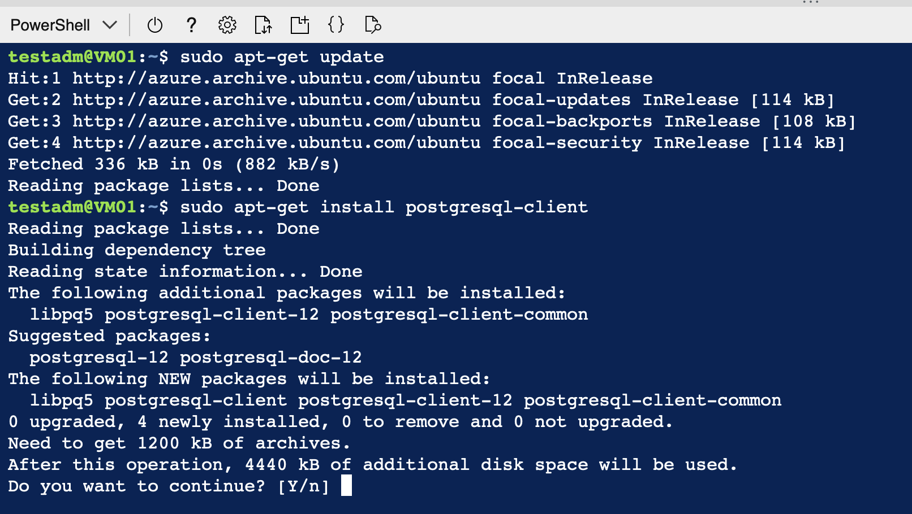

# Hands-on 02 – Explore Infrastructure As Code – Creating a new PostgreSQL server using Terraform 

Azure Database for PostgreSQL Flexible Server is a managed service that you can use to run, manage, and scale highly available PostgreSQL servers in the cloud.

Hashicorp Terraform is an open-source IaC (Infrastructure-as-Code) tool for provisioning and managing cloud infrastructure. It codifies infrastructure in configuration files that describe the desired state for your topology.

Terraform enables the definition, preview, and deployment of cloud infrastructure. Using Terraform, you create configuration files using HCL syntax. The HCL syntax allows you to specify the cloud provider - such as Azure - and the elements that make up your cloud infrastructure. After you create your configuration files, you create an execution plan that allows you to preview your infrastructure changes before they're deployed. Once you verify the changes, you apply the execution plan to deploy the infrastructure.

In this hands-on, you learn how to create an Azure PostgreSQL Database using Terraform:

* Configure Terraform in Azure Cloud Shell with Azure PowerShell
* Clone repository 
* Initialise terraform provider
* Create & apply Terraform execution plan
* Connect & work with the database 
* Clean Up resources

## Prerequisite
This hands-on is in continuation with the previous hands-on to create VM
<a href="/01_Create_VM.md">Hands-on 01 – Explore Azure GUI – Creating a new VM using Azure Portal</a> <br/>
Please ensure the same is completed and you are in the same sandbox environment. 
##  Reference
To explore more info about Terraform on Azure,

https://learn.microsoft.com/en-us/azure/developer/terraform/overview

## Configure Terraform in Azure Cloud Shell with Azure PowerShell

1. If you already have a Cloud Shell session open from the previous hands-on, skip to step 3
2. Open Cloud Shell. If you haven't previously used Cloud Shell, configure the environment and storage settings. Select the command-line environment as PowerShell.
    
3. Execute the following commands in sequence to: </br >
    a. Run curl, to download the latest terraform version for update in the cloud shell </br >
    b. Unzip the file </br >
    c. create a directory named bin </br >
    d. Move the terraform file into the bin directory </br >
    e. Close and restart Cloud Shell </br >
    ```console

            curl -O https://releases.hashicorp.com/terraform/1.3.6/terraform_1.3.6_linux_amd64.zip
            unzip terraform_1.3.6_linux_amd64.zip
            mkdir bin
            mv terraform bin/    
            exit
     ```
    
    f. Click <b>Reconnect</b> to complete cloud shell restart
    
4. Verify that the downloaded version of Terraform is first in the path.
    ```console
        terraform version
     ```
     

## Clone repository 

1. Clone the code to create an Azure PostgreSQL Database using Terraform using the below code.
    ```console
    git clone https://github.com/vjs01/SG-PPS-Azure-Workshop_Vj
     ```
     
2. Navigate to the clone directory and verify the tf files
    ```console
    cd SG-PPS-Azure-Workshop_Vj/terraform 
     ```
     

Explore the files in the folder to understand the code and structure of terraform provisioning.

## Initialise terraform provider

1. Run terraform init to initialize the Terraform deployment. This command downloads the Azure modules required to manage your Azure resources.
    ```console
    terraform init
     ```
     

## Create & Apply a Terraform execution plan

1. Run terraform plan to create an execution plan.
    ```console
    terraform plan -out main.tfplan
     ```
      </br> 
    <b> Key points: </b> </br>
    - The <b> terraform plan </b> command creates an execution plan, but doesn't execute it. Instead, it determines what actions are necessary to create the configuration specified in your configuration files. This pattern allows you to verify whether the execution plan matches your expectations before making any changes to actual resources. </br>
    - The </b> optional -out parameter </b> allows you to specify an output file for the plan. Using the -out parameter ensures that the plan you reviewed is exactly what is applied.
2. Run terraform apply to apply the execution plan to your cloud infrastructure.
    ```console
    terraform apply main.tfplan
     ```
      </br> 
    <b> Key points: </b> </br>
     - The <b> terraform apply </b> command above assumes you previously ran <b> terraform plan -out main.tfplan</b>.
     - If you specified a different filename for the <b> -out </b> parameter, use that same filename in the call to <b> terraform apply</b>.
     - If you didn't use the <b>-out</b> parameter, call <b>terraform apply</b> without any parameters.
3. Note down the values for the <resource_group_name>, <server_name>, and <database_name> are displayed in the terraform apply output.
4. The database is provisioned using a random password. Use the following command to output the password used. 
     ```console
    terraform output -json
     ```
      </br> 
     Note the password value from the file. </br>

## Connect & work with the database 
### Connect to the database server from Azure Linux virtual machine
For the purpose of this exercise, we will connect to the database from the VM created in,</br>
<a href="/01_Create_VM.md">Hands-on 01 – Explore Azure GUI – Creating a new VM using Azure Portal</a> <br/>

For this exercise you need the following information about the VM, </br>
* Public IP address
* Login username
* Login password 

1. Create an SSH connection with the VM using Bash or PowerShell. At your prompt, open an SSH connection to your virtual machine. Replace the IP address with the one from your VM & username with your login username.
    ```console
    ssh username@ip-address
    ```
    Enter <b> Yes </b> to accept the connection & provide the password when prompted. </br>
     </br> 
2. You need to install the postgresql-client tool to be able to connect to the server.
     ```console
    sudo apt-get update
    sudo apt-get install postgresql-client
     ```
3. Connections to the database are enforced with SSL, hence you need to download the public SSL certificate.
    ```console
    wget --no-check-certificate https://dl.cacerts.digicert.com/DigiCertGlobalRootCA.crt.pem
    ```
     </br> 
4. With the psql client tool installed, we can now connect to the server from your local environment. </br>
     ```console
    psql --host=<server_name>.postgres.database.azure.com --port=5432 --username=adminTerraform --dbname=<database_name> --set=sslmode=require --set=sslrootcert=DigiCertGlobalRootCA.crt.pem
     ```
    Replace server_name & database_name with the values noted before.
    </b> Provide the database password when prompted. </br>
     </br> 
### Working with the database

1. In the connected psql client, use the following command to create a table
    ```console
    create table inventory (id serial primary key,name varchar(50),quantity integer);
     ```
      </br> 
2. Insert a few records to the table,
    ```console
    INSERT INTO    inventory (id,name,quantity) VALUES   (1,'Samsung',135);	
    INSERT INTO    inventory (id,name,quantity) VALUES   (2,'Iphone',182);
    ```
      </br> 
3. Verify the insert using a select statement
    ```console
    Select * from inventory;
     ```
      </br> 
    You will be able to see the records in the CLI 
4. Use <b> Exit </b> to exit out of the psql client and get to the VM shell 
5. Use <b> Exit </b> again to exit out of the VM and get to the Azure Cloud Shell

## Clean up resources

This part of the exercise is optional. As this sandbox is a timed temporary environment, clean up is handled automatically on ending the lab on PluralSight. 

However, please feel free to try how terraform cleans up the provisioned resources.

1. Run terraform plan and specify the destroy flag.
     ```console
    terraform plan -destroy -out main.destroy.tfplan
     ```
      </br> 
      This is a speculative destroy plan, to see what the effect of destroying would be.
2. Run terraform apply to apply the execution plan.
    ```console
    terraform apply main.destroy.tfplan
     ```
    Alternatively you can directly apply to terraform with -destroy option. 
    ```console
   terraform apply -destroy
     ```

Note: You can delete all resouces provisioned, by deleting the resource group in the Azure portal. 

Congrats, you have completed hands-on successfully.

<p align="right">(<a href="/README.md">Back to main page</a>)</p>

## Reference
To explore more about provisioning with terraform, visit

https://developer.hashicorp.com/terraform/cli/run


