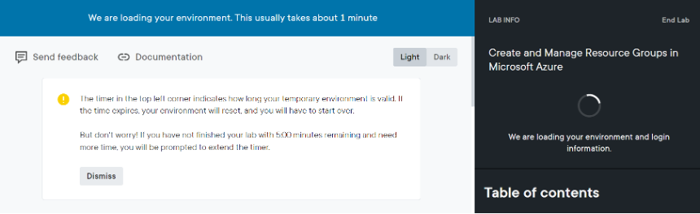

# Setup Azure Sandbox in Pluralsight 
## Prerequisite

1. An active Pluralsight subscription
    Pluralsight login info (username & password)
2. Personal or training laptop
    Note: SG network firewall restricts access to the Cloud sandbox environment. Hence you need to use either a personal laptop and wifi (unrestricted connectivity) or training laptop connecting to guest wifi
## Login to PluralSight

1.  In Chrome or Edge browser, open Pluralsight
    https://www.pluralsight.com
2. Click "Sign in" from the top right corner of the page & choose the option to “Sign in to SKILLS”
    
3. In the login page, enter your pluralsight username & password. Click <b> Sign in </b> to be redirected to the Pluralsight home page
    
    Click on <b> Leave Page </b> if prompted.

## Create Azure Sandbox

Pluralsight-created labs enable hands-on practice in a secure, temporary, and Pluralsight-provided environment.

For the purpose of this workshop we will use an Azure lab named “Create and Manage Resource Groups in Microsoft Azure” 

1. In the pluralsight home page, use the search box on the top to search for the above mentioned lab
    
2. In the search results, you will be provided with a list of Labs and Courses.Click on the first link that has a tag of “Lab” 
    
3. Click "Start lab" to enable the sandbox 
     
4. The sandbox environment will start loading.  
    <b>NOTE:</b> The sandbox environment provisioning will take a few minutes.  Typical waiting time is about 5 minutes. 
    
    On successful provisioning, the lab will provide you with a sandbox environment & temporary login for working with Azure. 
    
    Note the time remaining at the top right hand corner of the page.

## Login to Azure
1.  In Chrome or Edge browser, open Azure Portal  
    <b> Recommedation:</b> Use incognito or private browsing mode for best experience.  
    https://portal.azure.com
2.  In the Azure login page, provide the email id and password from the lab  
<b>TIP: </b> Use copy in the lab page to copy the credentials
    
3.  On successful login, you will be redirected to the Azure portal home
    

  <b> Congrats, your Azure sandbox environment is ready to proceed with the hands-on. </b>

To create a VM in Azure using the portal follow the below link,

<a href="/01_Create_VM.md">Hands-on 01 – Explore Azure GUI – Creating a new VM using Azure Portal</a>  

(<a href="/README.md">Back to main page</a>)

## Reference

Check out the following link for more info on Azure portal.

https://learn.microsoft.com/en-us/azure/azure-portal/azure-portal-overview

